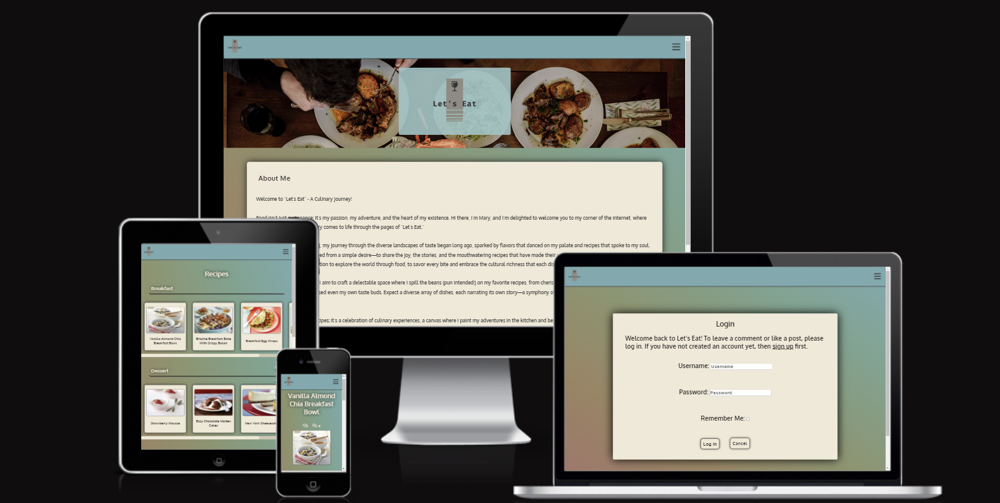
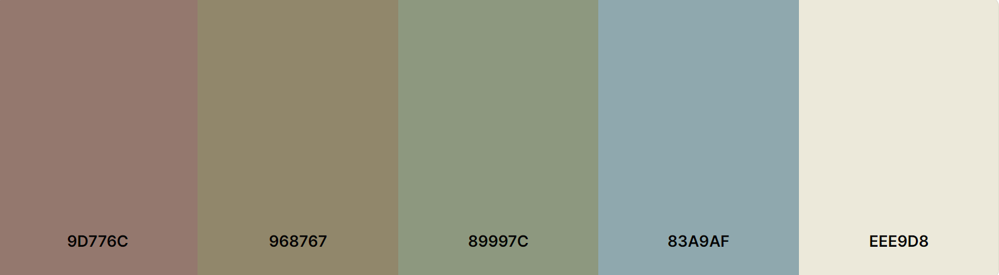
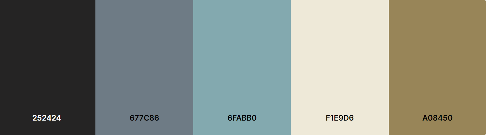
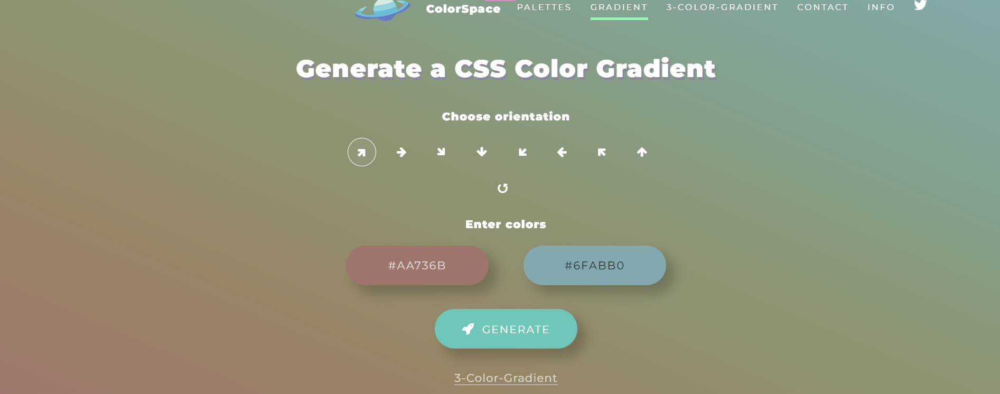
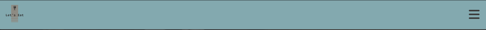
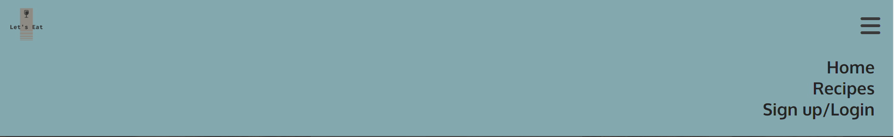
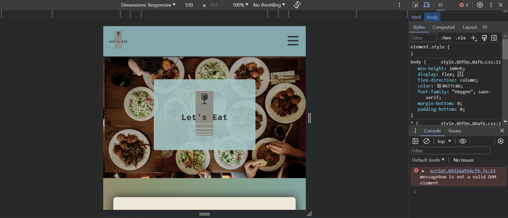

# Let's Eat

Let's Eat is a fully responsive full-stack website that I have built using the Django Full Stack framework for my Portfolio Project 4. This website gives the user the ability to browse recipies based on their category, comment on and like them.
  
  

[Click Here To Visit Live Site](https://maryclaireteahan-letseat-0b5910f8e882.herokuapp.com/)  

## Table Of Contents:
1. [Design & Planning](#design-&-planning)
    * [User Stories](#user-stories)
    * [Wireframes](#wireframes)
    * [Agile Methodology](#agile-methodology)
    * [Typography](#typography)
    * [Colour Scheme](#colour-scheme)
    * [Database Diagram](#database-diagram)
    
2. [Features](#features)
    * [Navigation](#Navigation-bar)
    * [Footer](#footer)
    * [Index page](#index-page)
    * [Recipes page](#recipes-page)
    * [Single recipe page](#single-recipe-page)
    * [Edit comment page](#edit-comment-page)
    * [Delete comment page](#delete-comment-page)
    * [Create recipe page](#create-recipe-page)
    * [Edit recipe page](#edit-recipe-page)
    * [Delete recipe page](#delete-recipe-page)
    * [Login page](#login-page)
    * [Logout page](#logout-page)
    * [Sign up page](#signup-page)

3. [Future Features](#future-features)
4. [Technologies Used](#technologies-used)
5. [Libraries](#libraries-used)
6. [Testing](#testing)
7. [Bugs](#bugs)
8. [Deployment](#deployment)
9. [Credits](#credits)
10. [Acknowledgements](#acknowledgements)

<!-- ## Design & Planning:

### User Stories
#### First time visitor
- As a first-time visitor, I want to understand the purpose of the website and easily navigate through
- As a first-time visitor, I want to be able to view the posts so that I would get quick access to relevant information and get a better understanding of the content
- As a first-time visitor, I want to be able to see likes and comments for the posts to get some feedback from other users
- As a first-time visitor, I want to be able to register an account to have more access to the website
- As a first-time visitor, I want to be able to search posts by title name so I could get quick access to the relevant one
- As a first-time visitor, I want to be able to subscribe to the blog so I could get relevant information about future blog posts
#### Registred user
- As a registered user I want to be able to leave comments for posts so that I can engage with other users and, leave feedback about certain posts
- As a registered user I can update or delete my comments so that have more control over my content in case of errors, and to have better engagemant with other users
- As a registered user I want to be able to like/unlike posts so that I can support certain posts without providing comment
- As a registered user I want to be able to update my profile information so that I could change my first name, last name, email and password and add a profile picture, bio
#### Site owner
- As a site owner, I want to be able to create, update and delete posts so that I can control my website content
- As a site owner, I want to be able to approve or delete comments so that I can filter out objectionable comments
-As a site owner, I want to be able to access all subscribed emails so that I could send new information related to my website
- As a site owner, I want to be able to delete users so that I can receive several benefits such as: manage my data, reduce liability & resource optimization  -->

### Wireframes
Below are the wireframes for the site that I created using balsamiq. As I was developing my website I was using agile approach and adding/updating my website/elements so for that reason some wireframes are not matching my final product.
#### Desktop

Index

Recipe Categories

Single Recipe

Edit Comment page

Delete Comment and Delete Recipe

Create and Edit Recipe

Login page

Logout page

Sign up page

<!-- ### Agile Methodology
The Agile Methodology was used to plan this project. I found it hard to work parallel on agile and on my coding as I was team of 1 and was aware of the changes so I found that to be confusing. I had to add a few things at the end of my project in github repository. I did learn more towards the end of the project about the use of the agile develepment, and why it's important and usefull to keep track of the whole process and to implement as much as you can. 
I've used Github and the Project Board with use of the Kanban board.

I devided project board into 3 sections:

  -  To-Do- (All the User stories were initially entered in the 'To Do' column)
  -  In Progress- (then during development story they were moved into the 'In Progress' column)
  -  Done- (and then finally they get moved into 'Done' once the development completes)

Project board

- I've planned 5 itterations for this project. Four were completed as planned and fifth one is for future development of the webiste, which is described more in feature features in this document

Milestones

- Each milestone consist of user stories, which are displayed either open or closed depends on the progress.
Each user story is labeled either as 'must-have', 'should-have' or 'could-have'depending of the needs of the project with estimated story points attached.

Milestone detail

- Each user story have acceptance criteria and tasks that needed to be done to accomplish  that criteria
 

User story detail

 -->

### Typography
Google Fonts were used to import Oxygen font into styles.css.  It was chosen as it is a simple, font with a strong clear feel that doesn't distract from the content.

### Colour Scheme
For this website, I chose a hero image and based the color palette off of that. There is a contrast between the dark fonts and light backgrounds in order to keep the site accessible.
  

Color palette

<!-- ### DataBase Diagram
Below is the database diagram that I created using LucidCharts.

DataBase diagram

  -->

## Features:

### Navigation Bar
- The navigation bar has a consistent look and placement on all three pages of the website supporting easy navigation.  It includes a simple Logo, and the menu options: Home page, Recipes page, Login page, Signup page and Logout page and is responsive on multiple screen sizes. The menu options are hidden until a burger icon is clicked which then brings up the menu options.

Navbar

### Footer
- The footer is featured on all five pages and is identical on each page making it easy to use.  It contains links to Adrienne's social media accounts, facebook, twitter, youtube, instagram and linkedin. The links are represented by favicon images of those sites' own logos.
  

Footer

### Index Page
- This section of text introduces the user to the blogger, Mary, and gives them a sense of what to expect if they continue reading the blog. The user is enticed to with a "Discover Recipes" button to move to the recipes page.

Index Hero

Index Button

### Recipes page
- This section of text gives the user five categories of recipes to browse, Breakfast, Lunch, Dinner, Dessert and Snack. The recipes are presented horizontally with use of a scrollbar if there are enough recipes that they don't fit the width of the screen size. Each recipe has a name and image, either of which can be clicked to reidirect to the recipe page.

Recipe Categories

Recipe Categories Scrollbar

  
### Single Recipe page
- This user is redirected to this section after selecting the recipe in the previous page. If the user is an admin they will see an option to edit or delete the recipe. The user will see the same image as the previous page, the ingredients and instructions. Underneath this is the comment section. Is the user has logged in they will be able to leave a comment as well as edit or delete it once posted, they will not be able to make any changes to other users' comments. If a user is not logged in they cannot leave a comment however they can read other users' comments

Single Recipe Like and Comment Icons

Single Recipe Comments

### Edit Comment page
- On this page the logged in user will see a textarea which contains the comment they had already left and on which they clicked edit. The user with be able to make changes to their comment and resubmit it. 

Edit comment page

### Delete Comment page
- The user will be redirected to this page when they click delete on their comment in order to make sure they want to delete the comment. The user will be asked if they are sure and they can either hit delete or cancel. Delete will delete the comment comepletely. Cancel will redirect to the home screen

Delete comment page

### Create recipe page
- Only user admin has access to this page. The user admin will be required to fill out each field before they can submit the recipe which will publish immediately.

Create recipe page

### Edit recipe page
- On this page the logged in user admin will see textareas in the same format as the creat recipe form which contains the recipe content they had already submitted and on which they clicked edit. The user with be able to make changes to their recipe and resubmit it. 

Edit recipe page

### Delete recipe page
- The user will be redirected to this page when they click delete on their recipe in order to make sure they want to delete the comment. The user will be asked if they are sure and they can either hit delete or cancel. Delete will delete the recipe comepletely. Cancel will redirect to the home screen

Delete recipe page

### Login page
- Login page is a basic django allauth form that has 2 input fields for username and password with sign in the button below it
- A User will also have description links to either signup for the website if he doesnt have an account which will redirect a user the "Sign up" page

Login page

### Logout page
- The user will be redirected to this page when they click logout. The user will be asked if they are sure they want to logout and they can either hit logout or cancel. Logout will log the user out. Cancel will redirect to the home screen

Logout page

### Signup page
- The signup page is also a standard django form with all required fields for a user to input
- User must input all information (username, email (optional) and password) 
- After inputting all the fields and clicking sign-up button user will be automatically logged in and redirected to the home page.

Sign up page

## Future Features

Future features

- There are 3 features that I would like to implement in the next iteration that would improve user experience and attract more traffic to my website
- Give users the option to reply to other users' comments
- Allow users to reset their passwords
- Add a top picks section where the user admin can update their top picks of their recipes weekly

## Technologies Used
- [Balsamiq](https://en.wikipedia.org/wiki/Balsamiq) was used to create the wireframes.
- [LucidChart](https://www.lucidchart.com/pages/) was used to design the database schema.
- [HTML](https://en.wikipedia.org/wiki/HTML) was used for the mark up.
- [CSS](https://en.wikipedia.org/wiki/CSS)  was used to style the site.
- [Django](https://www.djangoproject.com/) was the framework that was used.
- [Python](https://en.wikipedia.org/wiki/Python_(programming_language)), django is a python framework.
- [JavaScript](https://en.wikipedia.org/wiki/JavaScript) was used for interactiveness with the messages.
- [Gitpod](https://www.gitpod.io/about) was used to create this site and then push everything to github.
- [Heroku](https://en.wikipedia.org/wiki/Heroku) is used to host this site.
- [Github](https://en.wikipedia.org/wiki/GitHub) was used to store the code.
- [Git](https://en.wikipedia.org/wiki/Git) was used for version control.
- [Cloudinary](https://cloudinary.com/) was used to store the images.
- [ElephantSQL](https://www.elephantsql.com/) was used to store the database.
- - -

<!-- ## Libraries
- asgiref - A standard Python library to allow for asynchronous web apps and servers to communicate with each other.
- cloudinary - A Python package allowing integration between the application and Cloudinary.
- coverage - is a third-party package that helps developers measure code coverage in their Python codebase.
- dj-database-url - A Django utility to utilise the DATABASE_URL environment variable to configure the Django application. Used with PostgreSQL.
- dj3-cloudinary-storage - A Django package that facilitates integration with Cloudinary storage.
- Django - A python package for the Django framework.
- django-active-link - A Django package used to highlight an active link in the site navigation bars.
- django-allauth - An integrated set of Django applications addressing user authentication, registration and account management.
- django-summernote - is a third-party package that provides a rich text editor widget for Django web applications.
- django-crispy-forms - A Django package that provides tags and filters to control the rendering behaviour of Django forms. 
- gunicorn - A Python WSGI HTTP Server for UNIX.
- oauthlib - A generic, spec-compliant, thorough implementation of the OAuth request-signing logic for Python 3.6+.
- psycopg2 - A PostgreSQL database adapter for Python.
- PyJWT - A Python library that allows for encoding and decoding of JSON Web Tokens (JWT).
- python3-openid - A set of Python packages to support use of the OpenID decentralized identity system.
- pytz - A Python package for world timezone definitions, modern and historical.
- Pillow - A Python Imaging Library adds image processing capabilities
- requests-oauthlib - A Python package for OAuthlib authentication support for Requests.
- sqlparse - A non-validating SQL parser for Python.
 -->
## Testing
The testing section can be found [here](TESTING.md).

## Bugs
| **Bug** | **Fix** |
| ----------- | ----------- |
| On index page hero image was not rendering on deployed site | Added the image in an img tag using static tags |
| Alert messages were displaying but without an x the remove the alert | Added static tags to the script tag in the base.html in order to load the javascript for the alerts |
| Admin page have no style | Set DEBUG to True| 
| Cancel button on edit pages wouldn't work unless I filled in required fields | Changed cancel button to a tag |
| No css style on Heroku | Before every deployment set debug to false and clear the cache |
| Ingredients and Instructions weren't required fields so recipe could be uploaded without them | Removed null and blank = True and gave a defualt value for both |
| Recipes uploaded without a category weren't rendering as the view requires a category | Removed null and blank = True and gave a defualt value for it |
| Every user was able to edit and delete recipes | Added condition that user must be a superuser in order to edit or delete recipies |
| Every user was able to edit and delete anyone's comment | Added condition that edit/delete option only appeared under the comments of the current site user |
| Site would not deploy to heroku | Removed unused import CAB from |

### Unresolved bugs and issues
| **Bug** | **Fix** |
| ----------- | ----------- |
| Ingredients and Instructions do not render in the form of a list even when typed as such in the textareas | X |
| Occaisionally when checking responsiveness in Dev Tools the Index page width shrinks causing white space on the right side of the screen.  | X |
| The order of the categories is random and not as listed in models.py | X |
| In dev tools in console I'm getting and error that messageRow is not a valid DOM element however it disappears when the alert message for logging in and out appears. | X |

Console issues

## Deployment
This website is deployed to Heroku from a GitHub repository, the following steps were taken:

#### Creating Repository on GitHub
- First make sure you are signed into [Github](https://github.com/) and go to the code institutes template, which can be found [here](https://github.com/Code-Institute-Org/gitpod-full-template).
- Then click on **use this template** and select **Create a new repository** from the drop-down. Enter the name for the repository and click **Create repository from template**.
- Once the repository was created, I clicked the green **gitpod** button to create a workspace in gitpod so that I could write the code for the site.

#### Creating an app on Heroku
- After creating the repository on GitHub, head over to [heroku](https://www.heroku.com/) and sign in.
- On the home page, click **New** and **Create new app** from the drop down.
- Give the app a name(this must be unique) and select a **region** I chose **Europe** as I am in Europe, Then click **Create app**.

#### Create a database On ElephantSQL
- Log into the [ElephantSQL](https://www.elephantsql.com/) website and click **Create new Instance**
- Enter a **Name** and keep the plan as **Tiny Turtle Free**, then **tags** field can be left blank, Select a region closest to you, I selected **EU-West-1(Ireland)** as I'm in Ireland. Then click **Review** and afterward click **create an instance**.
- On The Dashboard click on your database instance name.
- You will see the details for your database instance, in the URL section click on the copy icon to copy the database URL.
- Head over to gitpod and create a **Database URL** environment variable in your env.py file and set it equal to the copied URL.

#### Deploying to Heroku.
- Head back over to [heroku](https://www.heroku.com/) and click on your **app** and then go to the **Settings tab**
- On the **settings page** scroll down to the **config vars** section and enter the **DATABASE_URL** which you will set equal to the elephantSQL URL, create **Secret key** this can be anything,
**CLOUDINARY_URL** this will be set to your cloudinary url and finally **Port** which will be set to 8000.
- Then scroll to the top and go to the **deploy tab** and go down to the **Deployment method** section and select **Github** and then sign into your account.
- Below that in the **search for a repository to connect to** search box enter the name of your repository that you created on **GitHub** and click **connect**
- Once it has been connected scroll down to the **Manual Deploy** and click **Deploy branch** when it has deployed you will see a **view app** button below and this will bring you to your newly deployed app.
- Please note that when deploying manually you will have to deploy after each change you make to your repository.
- - -

## Credits
- [Stack Overflow](https://stackoverflow.com/) 
- [W3schools](https://www.w3schools.com/) this was great for looking up forgotten **CSS** syntax and how to use it.
- [CodeInstitute](https://learn.codeinstitute.net/) for their walkthrough project, which guided me with website build especially for publishing posts, comments and likes section which I code along with the video with few adjustments
- [BBC Good Food](https://www.bbcgoodfood.com/) for providing me some text and useful information for my posts
- [youtube](https://www.youtube.com/) videos from **codemy**, **netninja**, **veryacademy**, **djangolessons** and **ProgrammingWithJosh** channels for guidance and examples on how to create blog and improve website. I watch videos and tried to recreate some features accross my website such as 'search-box' & 'subscription', specific links could be found here
- [veryacademy](https://www.youtube.com/watch?v=k_RY1og4Zj0&list=PLOLrQ9Pn6cawWd-5UZM6CIm0uqFXeBcTd&ab_channel=VeryAcademy)
- [Allauth](https://django-allauth.readthedocs.io/en/latest/) for their documentation which was helpfull in creating user authentication
- [Shopify](https://www.shopify.com/) for providing me with tools to easier generate my idea and create logo
- [Djangoforbeginners](https://djangoforbeginners.com/) for providing useful information abut basic concepts and setup for django
- [DEV community](https://dev.to/) for helping me to setup email with django
- [Traversy media](https://www.traversymedia.com/) for providing me with the code for dissapering hero text
- [Lucidchart](https://lucid.app/) for providing me with tools to create my database system
- [Balsamic](https://balsamiq.com/wireframes/) was used to create wireframes

## Acknowledgements:
- I would like to thank my mentor Lauren-Nicole for all her support and guidance during this project 
- I would also like to thank our cohort facilitator Marko Tot, for sending me useful links as well as giving me one to one support when I was struggling particularly with the models.
- I would like to thank Hennadi and Mehatab who also helped me a lot when I was struggling with my models.

[Back to the top](#let's-eat)