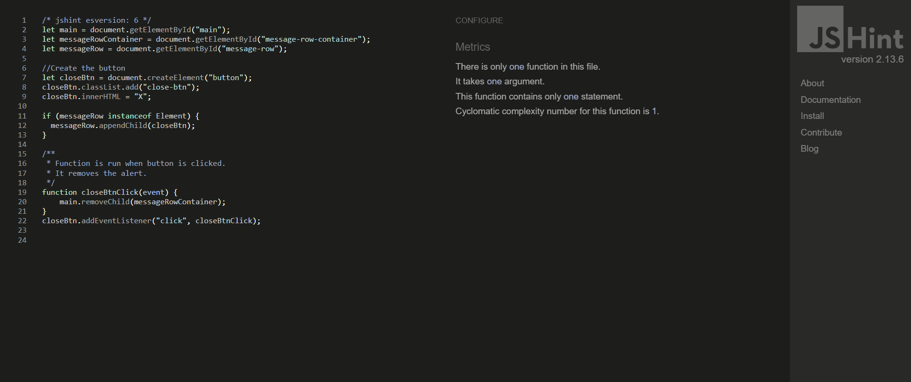
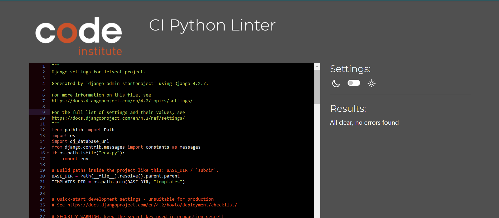

# TESTING

For a proper conclusion to this project several tests were performed.

## 🚀 TABLE OF CONTENTS

* [RESPONSIVENESS TESTING](#responsiveness-testing)
* [BROWSER COMPABILITY TESTING](#browser-compability-testing)
* [BUGS RESOLVED AND UNRESOLVED](#bugs-resolved-and-unresolved)
* [LIGHTHOUSE TESTING OUTCOMES](#lighthouse-testing-outcomes)
* [CODE VALIDATION](#code-validation)
* [USER STORIES TESTING](#user-stories-testing)
* [FEATURES TESTING](#features-testing)
* [AUTOMATED TESTING](#automated-testing)
* [TEST CASE](#test-case)

Return back to the [README.md](README.md) file.

- - -

## RESPONSIVENESS TESTING

👇

The deployed application was tested on multiple devices to check for responsiveness issues. The bootstrap classes were used to be as responsive as possible and there was no need to add media queries.

It works as expected according to the wireframes and no issue was found.

|Device| Screenshot | 
|:---|:---: |
| Desktop |    |
| Laptop  |    |
| Tablet  |    |
| Mobile  |   |

- - -

## BROWSER COMPABILITY TESTING

👇

The deployed project was tested on multiple browsers to check for compatibility issues and works as expected.

|Browser | Screenshot | 
|:---:|:---: |
| Chrome |  |
| Edge  |  |
| Firefox |   |

- - -

## BUGS RESOLVED AND UNRESOLVED 

☠️ The issues listed in the table below were indentified during the development of the project.

👇

|N.| Issue |  Action | Status | 
|:---|:--- |:--- |:--- |
|01| Table django_session don't exists | Command: python manage.py migrate sessions | Closed | 
|02 | After migration to codeanywhere, Error: pg_config executable not found | install psycopg2-binary | Closed |
|03 | After migration to codeanywhere, the app didn't run | Create virtual enviroment | Closed |
|04 | Sticky footer overlapping content | Remove class fixed-sm-bottom; add display: flex, direction: column and min-height:100vh to body and margin-top:auto to footer | Closed |
|05 | Bullets in nav list | Edit default in CSS nav ul {list-style-type: none;} | Closed |
|06 | Dropdown menu doesn't display own profile | Change the user.profile.pk to request.user.profile.pk | Closed | 
|07 | Profile_pic doesn't display correctly | Edit templates, change bootstrap classes | Closed |
|08 | Admin couldn't delete post or comment from other users | Edit the template and view adding request.user.is_superuser | Closed |
|09 | Inpunt form doesn't clean after submit | Add class form-control | Closed |
|10 | Default profile_pic doesn't display | Add boolean to templates | Closed |
|11 | Reply comment icon button doesn't work. Parent_id was not found. | Remove '' from argument in the function.  | Closed |
|12 | Default profile picture doesn't be displayed at followers_list. | Edit the template followers_list with boolean | Closed | 
|13 | ConnectionRefusedError at /accounts/password/reset/ | Google and Gitpod don't see eye-to-eye and will not send emails from a Google SMPT account. Use outlook account to send email to reset password, but got Error 500 at Heroku, then changed to a new google account, turn on the 2-Step Verification and use the App Password.| Closed |
|14 | Skip collestactic at Heroky during deployment | Run the command `python manage.py collectstatic` then deploy the project again. | Closed|
|15 | Couldn't test the application using a free version of Elephant as a database | Create a temporary database to test the application | Closed |
|16 | Post and Comment form doesn't clear after it's submitted | Call the empty form after save the content posted | Closed |
|17 | After changed the password redirects to change password page | Add a path with reverse_lazy to overwrite django allauth | Closed |
|18 | Post author couldn't delete comments in own post | Edit view and template adding if request.user == post.author. | Closed |
|19 | The table of contents on the README.md an TESTING.md doesn't work due to emojis in titles. | Remove all emojis from titles. | Closed|
|20 | NameError: name 'settings' is not defined | Remove the static from urls | Closed |
|21 | Pagination from Search and Users doesn't work correctly | Add `&amp` due to paramenters.| Closed |
| 22 | Video of the testing exceeds GitHub's file size limit and push was rejected | Delete video, `git reset --soft` was used to reset the last three commits, new commit was done with the changes, then the code was pushed to GitHub successfully | Closed | 

There are no remaining bugs.

- - -

## LIGHTHOUSE TESTING OUTCOMES

👇

The deployed project was tested using the Lighthouse Audit tool to check for any major issues. The results for each page are listed bellow.

Notes:

* **Best Practices**: Displays images with incorrect aspect ratio - this will happen due to the uploading of photos by the user.

* Some tests were made using DevTool with Google Chrome, but it was very slow and other tests were made with Microsoft Edge, where the language was German. (Leistung = Performance, Barrierefreiheit = Accessibility)

|Page | Screenshot | 
|:---:|:---: |
|Index Desktop ||
|Index Mobile ||
|All Recipes Desktop ||
|All Recipes Mobile ||
|Single Recipe Desktop ||
|Single Recipe Mobile ||
|Delete Comment Desktop ||
|Delete Comment Mobile ||
|Edit Comment Desktop ||
|Edit Comment Mobile ||
|Add Recipe Desktop ||
|Add Recipe Mobile ||
|Edit Recipe Desktop ||
|Edit Recipe Mobile ||
|Delete Recipe Desktop ||
|Delete Recipe Mobile ||
|Signup Desktop ||
|Signup Mobile ||
|Login Desktop ||
|Login Mobile ||
|Logout Desktop ||
|Logout Mobile ||

- - -

## CODE VALIDATION

👇

### HTML

The [HTML W3C Validator](https://validator.w3.org/) to validate all HTML files.
In order to properly validate the HTML pages with Jinja syntax, the steps are followed for each file:

- Navigate to the deployed application using Google Chrome,
- Right-click anywhere on the page, and select View Page Source.
- Copy the entire "compiled" code, without any Jinja syntax., and use the validate by input method.

The result for each page are listed bellow:

|Page |Screenshot | Notes  | 
|:---:|:----------------------:|---|
| Index |  | No Errors |
| All Recipes |  | No Errors |
| Single Recipe |  | No Errors |
| Edit Comment |  | No Errors |
| Delete Comment |  | No Errors |
| Add Recipe |  | No Errors |
| Edit Recipe |  | No Errors |
| Delete Recipe |  | No Errors |
| Signup |  | Error with signup form not accessible |
| Login |  | No Errors |
| Logout |  | No Errors |
| 404 |  | No Errors |

- - - 

### CSS

The [CSS Jigsaw Validator](https://jigsaw.w3.org/css-validator/) was used to validate the CSS file.

| File | Screenshot | Notes |
| --- | --- | --- |
| style.css | | No Errors |

- - - 

### JAVASCRIPT

The [JShint Validator](https://jshint.com/) was used to validate the JavaScript file.

| File | Screenshot | Notes |
| --- | --- | --- |
| script.js |  | No Errors |

- - - 

### PYTHON

The [Code Institute Python Linter](https://pep8ci.herokuapp.com)was used to validate all Python files.

#### Network project

| File | Screenshot  | Notes|
| --- | ------ |:---:|
| settings.py |    | Pass - Line too long due to AUTH_PASSWORD_VALIDATORS|
| urls.py (main) |    | Pass |
| views.py |   | Pass |

#### Blog app

| File | Screenshot  | Notes|
| --- | --- | --- |
| admin.py |    | Pass |
| forms.py |    | Pass |
| models.py |    | Pass |
| urls.py |    | Pass |
| views.py |    | Pass |

- - -

## USER STORIES TESTING

👇

The implemented User Stories were tested during the development of this project and also after it was finished with the below user acceptance testing:

Check out the video with some tests by clicking [here](documentation/video/test.mp4).

There are several screenshots of the features in the [README.md](README.md) file.

### Site User

- - -

As a Site User, I want to be able to:

*Must Have*

| User Stories |  Notes|
| --- | --- | 
| view a list of recipes so that I can choose one to read. | Pass |
| click on a recipe post so that I can read the full recipe. |  Pass |
| see how many likes a post has received so that I can see what recipes are most popular. | Pass |
| see who commented what under each post so that I can see what the Site Users think of specific recipes and how they might change them. | Pass |

*Should Have*

| User Stories |  Notes|
| --- | --- | 
| sign up to be a member/ login as an existing member so that I can be a part of the site's community. |  Pass |
| click a like button so that I can like a recipe and then unlike if needed. | Pass |

*Could Have*

| User Stories |  Notes|
| --- | --- | 
| post a comment on a recipe post so that I can interact with the site's community. | Pass |
| edit or delete my comment so that if I made a spelling error or changed my mind about what I said I can edit or delete it. | Pass |

### **Site Admin**

- - -

As an administrator for the site I want to be able to:

*Must Have*

| User Stories |  Notes|
| --- | --- | 
| create, edit and delete recipe posts so that I can be in control of what content is shown to Site Users. | Pass |
| assign a category to the recipe post so that Site Users will be able to find recipes specific to what they need. | Pass |
| see who commented what under each post so that I can see what the Site Users think of specific recipes and how they might change them. | Pass |
| see how many likes a post has received so that I can see what recipes are most popular. | Pass |

- - -

## FEATURES TESTING

👇

The features were manually tested as defensive programming during the development of this project and also after it was finished with the below user acceptance testing:

 Video recorded with testing:
  

| Page | User Action | Expected Result| Notes |
| --- | --- | --- | --- |
| **Index**   |  |  | |
| Landing | Click on Logo | Redirection to Home page | Pass |
| | Click on Sign Up button  | Redirection to Sign Up page | Pass |
| | Click on Sign In button | Redirection to Sign In page | Pass |
| Logged in | Click on Logo | Redirection to Main Feed | Pass |
| **Sign Up** |  |  |  |
| | Enter valid email address | Field will only accept email address format | Pass |
| | Enter valid password (twice) | Field will only accept password format | Pass |
| | Click Sign Up button on sign up page  | Redirects user to feed and displays message | Pass |
| | Click on Sign In link | Redirection to Sign In page | Pass |
| **Log In** |  |  |  |
| | Enter valid email address | Field will only accept email address format or valid username | Pass |
| | Enter valid password | Field will only accept password format | Pass |
| | Click Login button on login page | Redirects user to main feed and displays message | Pass |
| | Click Forgot Password | Redirects user to password reset page | Pass |
| | Click on Sign Up link | Redirection to Sign Up page | Pass |
| **Log Out** |  |  |  |
| | click on dropdown menu, then sign out | Redirects to sign out page | Pass |
| | Click to confirm to sign out  | Redirects to landing page and displays message with the sign out confirmation | Pass |
| **All Recipes** |  |  |  |
| | Create a post only with text as content | New post only with text is created | Pass |
| | Create a post only with picture | User is prompted to type something into the content field before sending | Pass |
| | Create a post with text and picture | New post with text and picture is created | Pass |
| | Click send on new post form without adding content | User is prompted to enter something into the field before sending | Pass |
| | Click on a post | User will be redirected to the post detail page | Pass |
| | Click on the username on a post | User will be redirected to the post author's profile | Pass |
| | Click the like button on a post | Like button will fill with colour and the like count will increase by 1, Post author receives a notification letting them know someone has liked their post | Pass  |
| | Click the like button on a post already liked by the user | Like button will become clear in the middle like count will decrease by 1 | Pass |
| | Click the dislike button on a post | Dislike button will fill with colour and the dislike count will increase by 1 | Pass  |
| | Click the dislike button on a post already liked by the user | Dislike button will become clear in the middle dislike count will decrease by 1 | Pass  |
| | Click edit icon on own post | User is redirected to post edit page | Pass   |
| | Click delete icon on own post | User is redirected to post delete confirmation page | Pass  |
| | Click on the pagination | Change the pages correctly | Pass |
| **Edit Recipe** | | | | 
| | Fill in post form and click submit | Original post can be edited | Pass | 
| | Click on the Back To Post button | User will be redirected to the original post | Pass | 
| **Delete Recipe** | | | | 
| | Click on the Delete button | Post will be permanently deleted | Pass | 
| | Click on the Back To Post button | User will be redirected to the original post | Pass | 
| **Comments on Recipe** | | | | 
| | Comment a post | New comment is created, the post author is notificated | Pass |
| | Click send on new comment form without adding content | User is prompted to enter something into the field before sending | Pass |
| | Click the like button on a comment | Like button will fill with colour and the like count will increase by 1, Post author receives a notification letting them know someone has liked their post | Pass  |
| | Click the like button on a post already liked by the user | Like button will become clear in the middle like count will decrease by 1 | Pass |
| | Click the dislike button on a post | Dislike button will fill with colour and the dislike count will increase by 1 | Pass  |
| | Click the dislike button on a post already liked by the user | Dislike button will become clear in the middle dislike count will decrease by 1 | Pass   |
| | Click edit icon on own comment | User is redirected to comment edit page | Pass  |
| | Click delete icon on own comment | User is redirected to comment delete confirmation page | Pass  |
| | Click on the username on a comment | User will be redirected to the comment author's profile | Pass | 
| | Click on the comment icon | Open a form to reply the comment | Pass | 
| | Click edit icon on own comment | User is redirected to comment edit page | Pass | 
| | Click delete icon on own comment | User is redirected to comment delete page | Pass | 
| | Click on the pagination | Change the pages correctly | Pass |
| | Attempt to delete a comment as admin | Admin is redirected to  delete page | Pass |
| | Brute forcing the URL to delete another user's comment if not on your post | Redirects user to error page | Pass | 
| **Edit Comment** | | | | 
| | Fill in comment form and click submit | Original comment will be edited | Pass | 
| | Click on the Back To Post button | User will be redirected to the original post | Pass | 
| **Delete Comment** | | | | 
| | Click on the Delete button | Comment or reply will be permanently deleted | Pass | 
| | Click on the Back button | User will be redirected to the original post | Pass | 
| **Error Pages** | | | | 
| | Click on Home button | User will be redirected to his feed | Pass | 
| **Footer** | | | | 
| | Click on Linkedin Icon | Redirects to LinkedIn from the creator of this application | Pass |
| | Click on GitHub Icon | Redirects to GitHub repository | Pass |
| | Click on "Lucimeri Andretta" link | Redirects to GitHub from the creator of this application | Pass |

- - -

Return back to the [README.md](README.md) file.